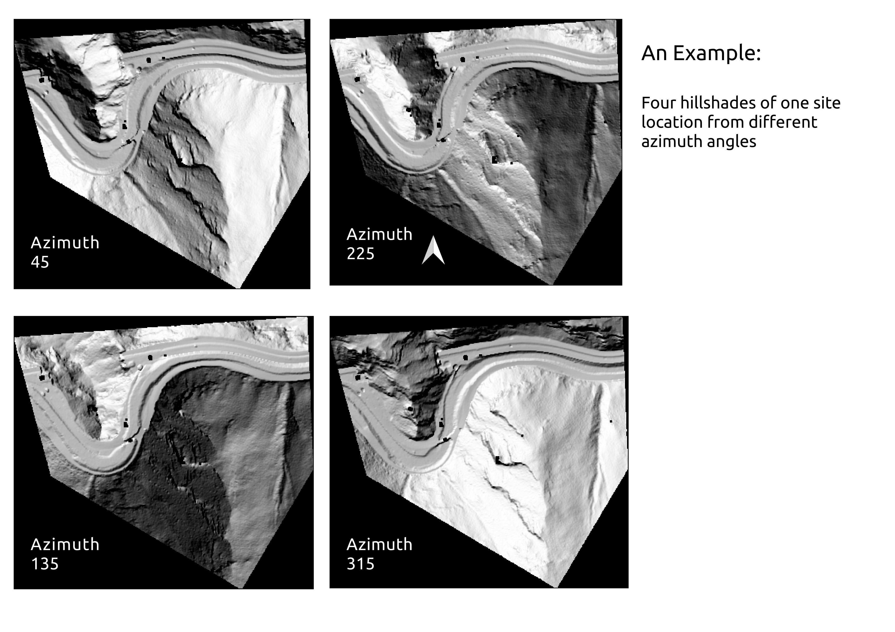

To read the jupyter notebook files it is best to use nbviewer as these files are way big. Open https://nbviewer.jupyter.org/ and put URL of file in your repository in the textfield as shown. Press Go button to view the notebook.

<h4>From publicly available lidar, I created dem's and overlaid them on a map of areas around Idaho Springs to see if it will show old mine 'holes'.</h4>

<h2> Idaho Springs area DEMs</h2>

<h3>Comparing azimuths of one of the sites</h3>

     
This project has been set up using PyScaffold 3.2.3. For details and usage
information on PyScaffold see https://pyscaffold.org/.
